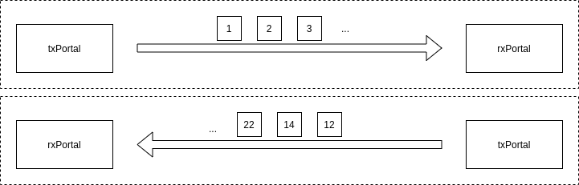
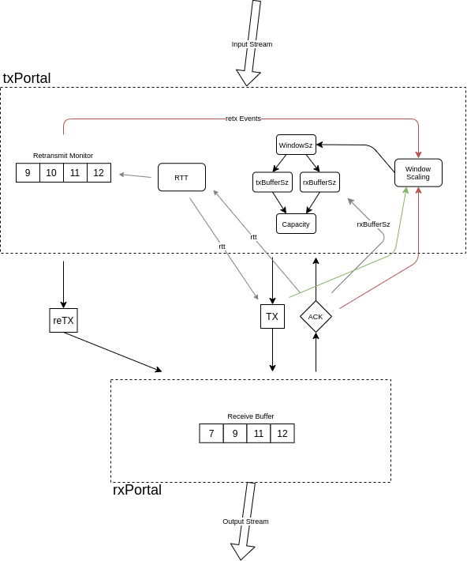

# Dilithium Framework Concepts

## Directional txPortal/rxPortal Pair

The message-oriented components are typically described here as one half of a bi-directional communications implementation. A single `txPortal`&rarr;`rxPortal` pair manifests a single direction of communication. To realize a bi-directional communications link, a pair of `txPortal`&rarr;`rxPortal` components will be required, one for each direction.

The `txPortal` admits data as an array of octets from another software layer, which it then turns into messages that are transmitted across the message-passing infrastructure. The `rxPortal` receives messages from the message-passing infrastructure and reconstructs these as a stream of octets, which are delivered to its client.

The message-passing infrastructure is assumed to be unreliable.

## Rate Limiting Flow Control

An important goal for these components is to simultaneously maximize the throughput of a message-passing system, while also limiting the flow such that the system is not overwhelmed. There's a delicate balance to be maintained, which must automatically adjust to changing backpressures and weather conditions.

`dilithium`-based protocols use a traditional _windowing_ model to manage the communication rate. In this framework, we call the window a _portal_ (because we're cheeky). The portal _capacity_ represents the total size of the data that is allowed to be present in the link, transiting between the `txPortal` and the `rxPortal` at the current point in time. the `txPortalSz` represents the amount of data managed in the transmitting side of the communication. The `rxPortalSz` represents the amount of data buffered in the receiving side.

The `txPortal` will only admit data from its client into the link when the minimum of the `(capacity - txPortalSz)` or `(capacity - rxPortalSz)` is equal to or larger than the size of the data the client wants to transmit. Until that amount of capacity becomes available, the `txPortal` will block its client, providing backpressure. 

## Loss Handling

`dilithium`-based implementations operate over unreliable message-passing infrastructures (primarily, UDP datagrams across the internet). In order to turn these unreliable message-passing systems into a reliable stream of communications, `dilithium` must implement loss handling and mitigation.

Also, unreliable message-passing infrastructures usually do not guarantee message ordering, and `dilithium` must also handle these cases as well.

And, to keep it interesting... the control messages (`ACK`) can also go missing or arrive in unusual orders. `dilithium` must also operate correctly in these cases.

In the diagram above, we see the 3 typical types of communications that happen between the `txPortal`&rarr;`rxPortal` pair. The first type of messages are the _nominal transmission_ messages, which are portions of the stream data that have been assigned a _sequence identifier_. Typically when the `rxPortal` receives these messages it sends back an _acknowledgement_ (`ACK`) message, notifying the `txPortal` that it received the payload. If the `txPortal` does not receive an `ACK` within a timeout period (see section below on _Round-Trip Time Probes_), it will retransmit the payload again. It will continue retransmitting at the end of the expiry period, until it receives an `ACK` from the `rxPortal`.

In cases where the `ACK` message went missing, the retransmission mechanism will ultimately re-synchronize the state of the message between the `txPortal`->`rxPortal` pair.

## Rx/Tx Components Overview

## Concepts in Progress

* Loss Handling
	+ Acknowledgement (ack)
	+ Retransmission (retx)
	+ Retransmission Monitor
* Round-Trip Time Probes
* Portal Scaling
	+ Successful Transmission
	+ Duplicate Acknowledgement
	+ Retransmission
* Profiles
* Protocol Manifestations
	+ westworld3
* Write Buffer (txPortal)
	+ Back-pressure
* Read Buffer (rxPortal)
	+ Ordering
	+ Back-pressure
* Extensible Framework
	+ Ziti Transwarp