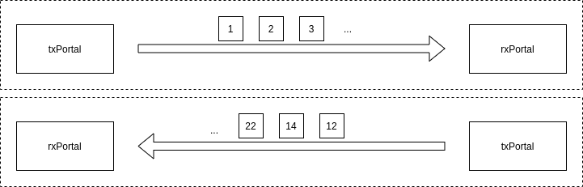
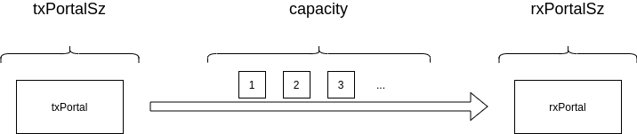
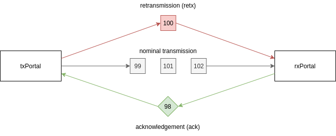
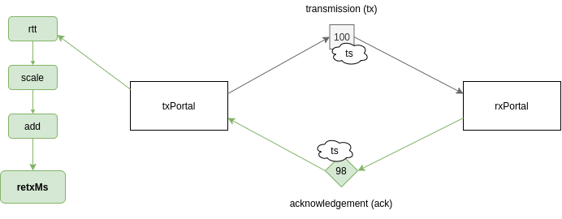
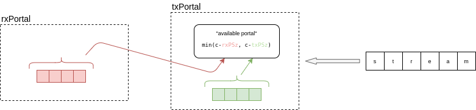
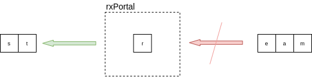
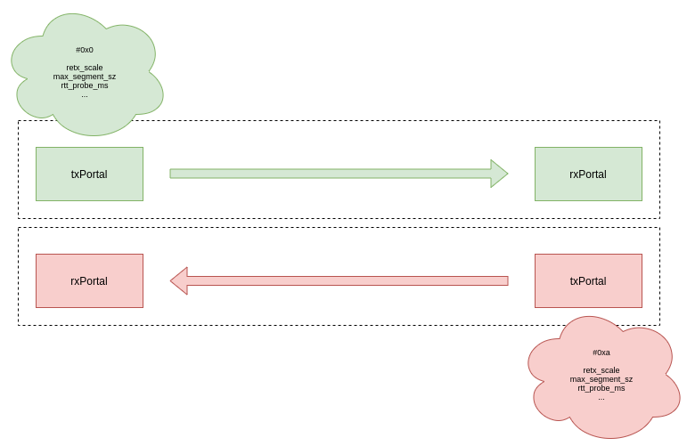
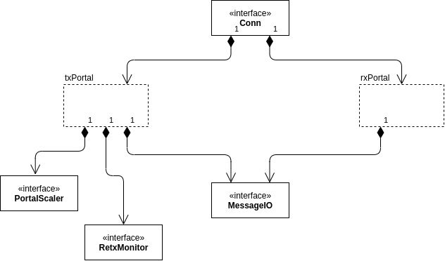
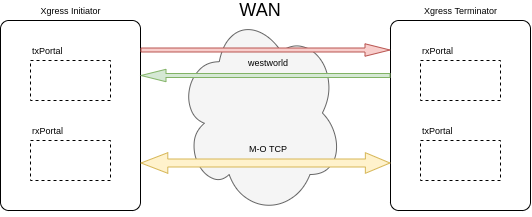
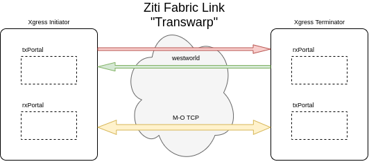

# Dilithium Framework Concepts

The `dilithium` framework is a software library for creating reliable, stream-oriented protocols built on top of unreliable message-passing facilities. TCP is an obvious example of this type of protocol.

The `dilithium` framework includes the `westworld` protocol, which is conceptually similar to TCP but focused on WAN performance optimization in challenging network weather conditions. `westworld` connections exhibit the same kinds of properties as a TCP connection in that it's a reliable, bi-directional data stream. `westworld` uses UDP datagrams as its unreliable message-passing infrastructure.

This guide provides a high-level tour of the major concepts implemented within `dilithium` components. Understanding each of these concepts orthogonally will help provide a clear understanding of how these features combine to solve performance and reliability issues.

## Directional txPortal/rxPortal Pair

The `dilithium` framework sees bi-directional communications as a pair of uni-directional communications links. Each link uses a symmetrical pair of components to facilitate communications for a single direction.

The top-level `dilithium` components include a `txPortal`, which manages the transmitting side of a link, and the `rxPortal`, which manages the receiving side.

The `txPortal` admits data as an array of octets from another software layer, which it then turns into messages that are transmitted across the message-passing infrastructure. The `rxPortal` receives messages from the message-passing infrastructure and reconstructs the stream of octets, which is delivered to its client.

## Rate Limiting Flow Control

An important goal for these components is to simultaneously maximize the throughput of a message-passing system, while also limiting the flow such that the system is not overwhelmed. There's a delicate balance to be maintained, and the implementation has to automatically adjust to changing backpressures and network weather conditions.

`dilithium`-based protocols use a traditional _windowing_ model to manage the message rate. In this implementation, we call the window a _portal_ (because we're cheeky). The portal _capacity_ represents the total size of the data that is allowed to be present in the link, transiting between the `txPortal` and the `rxPortal` at the current point in time. the `txPortalSz` represents the amount of data managed in the transmitting side of the communication. The `rxPortalSz` represents the amount of data buffered in the receiving side.

The `txPortal` will only admit data from its client into the link when the minimum of `(capacity - txPortalSz)` or `(capacity - rxPortalSz)` is equal to or larger than the size of the data the client wants to transmit. Until that amount of capacity becomes available, the `txPortal` will block its client, providing backpressure. While the `txPortal` is limiting the admission of new data, the `txPortal` and `rxPortal` collaborate through retransmission and acknowledgements to free up space in both the sending and receiving buffers. This will eventually un-block the admission of new data into the link.

## Loss Handling

`dilithium`-based implementations operate over unreliable message-passing infrastructures (primarily UDP datagrams across the internet). In order to convert these unreliable message-passing systems into a reliable stream of communications, `dilithium` must implement packet loss mitigation.

Also, unreliable message-passing infrastructures usually do not guarantee message ordering, and `dilithium` must also handle cases where messages arrive unordered.

And, to keep it interesting... the control messages (`ACK`) can also go missing or arrive in unusual orders. `dilithium` deals with these cases as well.

In the diagram above, we see the 3 typical types of communications that happen between the `txPortal`&rarr;`rxPortal` pair. The first type of messages are the _(nominal) transmission_ messages, which are portions of the stream data that have been assigned a _sequence identifier_, and contribute directly to the forward transmission of new data. When the `rxPortal` receives these messages it sends back an _acknowledgement_ (`ACK`) message, notifying the `txPortal` that it received the payload. If the `txPortal` does not receive an `ACK` within a timeout period (see section below on _Round-Trip Time Probes_), it will retransmit the payload again. It will continue retransmitting at the end of the expiry period, until it receives an `ACK` from the `rxPortal`.

When the `txPortal` receives an `ACK` for a message, it will remove that message from its buffers freeing up space to deal with the next chunk of data from its client.

In cases where the `ACK` messages go missing, the retransmission mechanism will ultimately re-synchronize the state of the message between the `txPortal`&rarr;`rxPortal` pair. Retransmission will occur until the sender finally receives an `ACK` for that message from the `rxPortal`.

## Retransmission Monitor

Inside the `txPortal` the _retransmission monitor_ maintains a list of payloads, ordered by their retransmission deadlines. It runs in a loop, sending the next payload again whenever the payload's deadline is reached. Once a payload is retransmitted, the next deadline for retransmission is computed and the payload is appended to the end of the list.

Deadline computation is performed according to the `txPortal`'s observed _round-trip time_ (`rtt`).

## Round-Trip Time Probes

A critical component in achieving high performance is retransmission of lost payloads with the correct timing. 

Payloads that are retransmitted too early are in danger of being unnecessary (the corresponding `ACK` for a successfully received payload may still be in transit). Un-needed retransmissions consume bandwidth that could be used for productive data movement. 

Payloads that are retransmitted too late reduce the overall perceived performance of the link. When a retransmission is necessary it often fills in a "hole" in the `rxPortal` buffer (like a Tetris piece), allowing a number of payloads to be released to the receiving client at once. The more payloads that are pending, waiting on a retransmission, the more performance impact will be felt by late retransmissions.

In order to achieve the tightest retransmission timing possible, `dilithium` uses configurable _round-trip time probes_. Probing is accomplished by capturing the current high-resolution wall clock time, and inserting that into an outbound payload. When the `rxPortal` receives a payload with an embedded `rtt` probe, it embeds that probe back into its outbound `ack` for that payload. When the `txPortal` receives an `ack` with an `rtt` probe embedded, it compares that probe timestamp to the current wall clock time to determine how long it took to get a response to that payload from the receiver.

`rtt` probes are sent according to a configurable period, and the resulting `rtt` value is averaged over a configurable number of previous probed time deltas. That averaged value is then scaled using configurable scaling and adjustment factors. The final value is output as `retxMs`, which is the number of milliseconds that the `retx` monitor should use in computing retransmission deadlines.

## Portal Scaling

The message flow rate is controlled by the _capacity_ of the portal (window). Finding the ideal sending rate, which results in the most productive data transfer with the least unnecessary retransmissions requires continual adjustment of the portal capacity.

In `dilithium` protocols, there are currently 3 main factors which contribute to scaling the portal capacity value.

Successfully acknowledged transmissions have the size of their productive payloads added to an _accumulator_. When the number of successfully acked transmissions reaches a configurable threshold value, the size of that accumulator is scaled (`tx_portal_increase_scale`) and the result is added to the `capacity` (window) size of the link. This is the primary mechanism that allows the window size to grow.

Duplicate acks (`dupack`) are counted. When the number of duplicate acks reaches a configurable threshold value, the portal capacity is scaled by a configurable value (`tx_portal_dupack_capacity_scale`).

Retransmissions (`retx`) are counted. When the number of retransmitted payloads reaches a configurable threshold value, the portal capacity is multiplied by a configurable value (`tx_portal_retx_capacity_scale`).

Whenever a counter reaches a threshold it is reset to zero. When `dupack` or `retx` counters reach their thresholds, in addition to multiplying the portal capacity by their `scale` values, they also multiply the successful transmission accumulator by a scale value (`tx_portal_dupack_success_scale`, `tx_portal_retx_success_scale`), allowing them to clear or adjust the successful transmission accumulator.

## Write Buffer (txPortal)

The `dilithium` framework implements the golang `net.Conn` interface (and `io.WriteCloser`). The `txPortal` client sends a stream of data to the `dilithium`-based protocol by invoking multiple `Write` calls, each providing a `[]byte` for the next chunk of the client's data stream.

The `txPortal` will block that `Write` call according to the flow control semantics described above. When the available `capacity` of the link is smaller than `len(data []byte)` the `txPortal` will block the client until the `capacity` becomes available.

## ReadBuffer (rxPortal)

`dilithium` includes a configurable posture for read buffering in the `rxPortal` implementation. The default configuration (as implemented in the `dilithium` `v0.2` UDP protocol `westworld2`) is to allow the `rxPortal`'s read buffer to grow unbounded. Or, more precisely, bounded by admission of payloads to the link by the `txPortal`. This is the simplest, most performant choice for systems without significant memory constraints.

`dilithium` `v0.3` includes support for upper buffer size bounds. When this bound is configured, a downstream client that is slow to consume outbound stream data through the `net.Conn`/`io.Reader` method `Read` will cause the `rxPortal` to drop inbound payloads that do not fill gaps in its internal buffers. Payloads that would progress the stream forward will be discarded, until the downstream client consumes enough data to clear space in the buffer for those new payloads.

This has performance impacts, obviously. But in cases where an unconstrained `rxPortal` buffer is a concern, this capability can be engaged. This capability is implemented to support `Payload` dropping based on Xgress `Read` rates in the `ziti-fabric`.

## Profiles

`dilithium` provides a mechanism for externally configuring all of the tunable parameters. Everything discussed previously in this concepts guide is tunable through the _profile_ mechanism.

When dealing with a pair of `txPortal`&rarr;`rxPortal` instances, there are effectively 2 profiles in use, one for each of the instances.

`dilithium` implementations can take advantages of asymmetric tunings, supporting asymmetric message-passing underlays. This means when implementing internet protocols on top of `dilithium`, a completely different profile can be used to tune the "upstream" versus the downstream.

As of version `0.3`, profile information is exchanged through the `HELLO` connection setup process. Future versions of `dilithium` will allow for dynamic profile exchange at any point in the lifecycle of a communications connection.

The current profile concept is a sealed set of knobs to tune the infrastructure for various operational and performance needs. Future iterations of the profile concept will likely expose extension points in the framework, allowing downstream code to participate in most of these framework concepts directly, chaning their behavior to even deeper degrees.

## Extensible Framework

`dilithium` differs from traditional protocol stacks in that it is constructed as a _framework_ for implementing reliable/streaming protocols on top of unreliable message-passing infrastructures.

Like most frameworks, `dilithium` provides a number of _hotspots_ or _extension points_ (_interfaces_) that can be extended using code specific to your protocol implementation or application.

This provides a number of benefits beyond just implementing custom protocols. By providing extension points around the major _orthogonal concerns_ of the framework, it means that even existing implementations can be tuned and adjusted to meet specific requirements. 

## Protocol Implementation: Westworld

`dilithium` ships with an optimized, UDP-based protocol for WAN optimization scenarios. It works similarly to TCP, but with a different congestion control and fairness model. It is designed to work well in challenging (lossy, latent, jittery) network weather conditions. It is also designed to be highly tunable, capable of supporting assymetric profiles (for links with different upstream and downstream characteristics), and real-time profile adjustments.

## Protocol Implementation: Transwarp

`dilithium` will be used to implement the _Transwarp_ capabilities within the [Ziti Fabric](https://github.com/openziti/fabric). The Ziti Fabric is an overlay network with advanced smart routing, designed for true programmable networking. `dilithium` is used to implement optimized "underlay" protocol support for the data plane in this stack. `dilithium` is useful, because it provides a single set of pluggable components that can be configured to work with message-oriented TCP connections between Ziti routers, or directly with UDP datagrams (i.e. `westworld`).